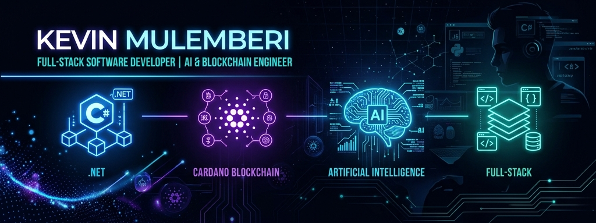
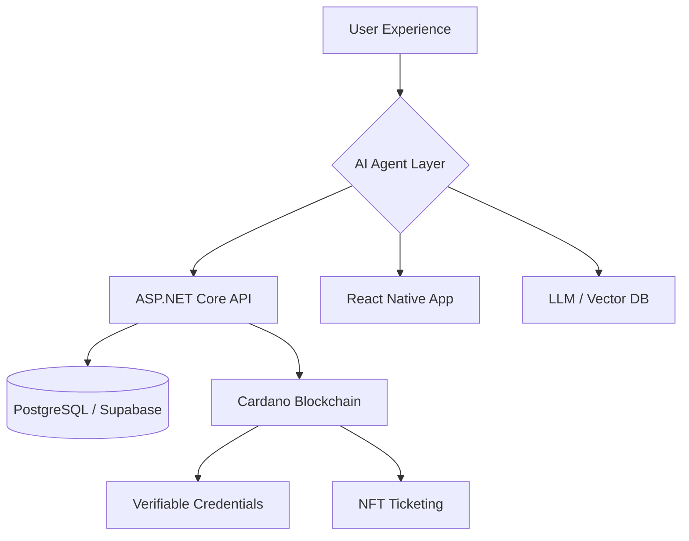

  
    
  
  # 👋 Hey, I'm Kevin Mulemberi
  
  ### 🚀 Full-Stack Architect • .NET Expert • AI & Cardano Developer
  
  

    <em>
      Architecting the future with high-performance .NET systems, decentralized Cardano ecosystems, and intelligent AI-driven workflows.
    </em>
  

  

    
    
    
  

---

I'm a visionary developer from **Kinshasa, DR Congo 🇨🇩** dedicated to engineering high-impact digital ecosystems. My approach merges industrial-grade performance with decentralized transparency:

- 🏗️ **Enterprise Architectures**: Building robust backends with **.NET 8 & ASP.NET Core**.
- ⛓️ **Decentralized Finance & ID**: Pioneering the **Cardano** ecosystem for secure, transparent systems.
- 🧠 **Cognitive Automation**: Integrating **AI Agents** and **RAG** systems into real-world workflows.
- 📱 **Seamless Mobility**: Delivering high-fidelity mobile experiences via **React Native**.

I transform complex challenges into elegant, scalable, and future-proof digital solutions.

Currently exploring:
- **Next.js + TypeScript ecosystems**
- **Supabase architectures**
- **React Native & Mobile Experiences**
- **AI Agents & Automation**
- **Blockchain & Cardano Ecosystem**
- **Real-time systems**
- **Event-tech platforms**
- **Medical & educational digital transformation**

---

# 🚀 Current Vision & Projects

### 🎟️ Immersive Event & Ticketing Ecosystem
A high-performance, decentralized platform designed to redefine event management through:
- **Blockchain Ticketing**: Secure, fraud-proof NFT tickets and collectibles powered by **Cardano**.
- **Guest Intelligence**: Predictive attendance modeling and real-time behavioral analytics.
- **AI Event Concierge**: Intelligent assistants for guest support and automated workflow management.
- **Real-time RSVP Systems**: Instant synchronization and interactive seating arrangements.
- **Dynamic Dashboards**: High-scale monitoring and operational analytics powered by **.NET**.
- **Immersive Experiences**: Interactive digital twin environments and audience engagement tools.

Built with:
`Next.js` • `TypeScript` • `.NET` • `Cardano` • `Supabase`

---

### 📚 Smart University & Academic Ecosystem
A comprehensive digital transformation platform for higher education institutions:
- **Blockchain Credentials**: Verifiable academic records and tamper-proof digital diplomas on **Cardano**.
- **Intelligent Resource Management**: AI-driven course scheduling and classroom optimization.
- **Smart Attendance**: Real-time tracking via cross-platform mobile apps (React Native/Expo).
- **Academic Analytics**: Deep-learning insights into student performance and institutional efficiency.
- **Robust Core**: Scalable backend services and API management powered by **ASP.NET Core**.

Built with:
`.NET 8` • `React Native` • `Cardano` • `PostgreSQL`

---

### 🤖 AI Integrated Systems & Agentic Workflows
Developing high-intelligence automation layers for specialized industries:
- **Medical AI**: Diagnostic assistance and patient data automation (HIPAA compliant architectures).
- **Agentic Workflows**: Autonomous multi-agent systems for productivity and complex decision making.
- **Semantic Search (RAG)**: Advanced knowledge retrieval systems for educational and corporate archives.
- **Automated Communication**: Intelligent omnichannel bots for seamless user interaction.

Built with:
`Python` • `OpenAI/LangChain` • `Vector Databases` • `.NET`

---

# 🧬 My Technology Synergy

---

# 🛠️ Tech Stack

## 🎨 Frontend
 

---

## ⚙️ Backend & Database
 

---

## 📱 Mobile
 

---

## 🧰 Tools & DevOps
 

---

# 📈 GitHub Stats

# 📈 GitHub Performance

  
  

  

  

---

---

# 🌍 Philosophy

> "Technology is not just about coding.  
> It's about building systems that change how people live, communicate, learn, and experience the world."

---

# 🚀 Let's Build The Future

I’m passionate about:
- Innovative startups
- AI-driven products
- SaaS ecosystems
- Blockchain & Cardano Ecosystem
- Digital transformation
- Modern UX systems
- Scalable infrastructures

Always open to:
- Collaboration
- Networking
- Startup ideas
- Open-source contributions
- Building impactful products

---